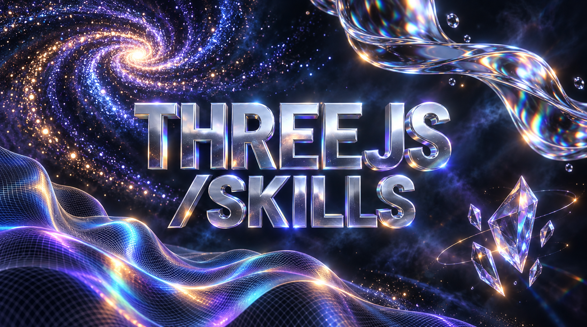

# Three.js Skills

Community-maintained AI skills for [Three.js](https://threejs.org/). Help coding agents build scenes, load models, write shaders, integrate React Three Fiber, and handle performance, accessibility, and delivery.

Uses the [Agent Skills](https://agentskills.io/) format. Install with the [skills CLI](https://github.com/vercel-labs/skills) for Claude Code, Cursor, Codex, and other supported agents. This project is independent of the Three.js maintainers.

## Install

Run in your web project:

```sh
npx skills add cesartevisual/threejs-skills
```

Choose your skills and agent when prompted. To target an agent or a skill directly:

```sh
npx skills add cesartevisual/threejs-skills --agent codex
npx skills add cesartevisual/threejs-skills --skill threejs-r3f
```

Use `claude-code` or `cursor` instead of `codex` for those hosts. Add `--global` for personal installation across projects.

### Clone or copy

From your web project, clone the collection into a sibling directory and install it:

```sh
git clone https://github.com/cesartevisual/threejs-skills.git ../threejs-skills
npx skills add ../threejs-skills
```

Or copy individual folders from `skills/` into your project's skill directory. Keep each `SKILL.md` and its references together.

| Agent | Project directory |
| --- | --- |
| Claude Code | `.claude/skills/` |
| Cursor | `.cursor/skills/` or `.agents/skills/` |
| Codex | `.agents/skills/` |

For Grok or another chat assistant, attach or paste the relevant `SKILL.md` and any references it links to. No custom installer or export tool is required.

## Use

Ask naturally or name a skill:

```text
Use threejs-web to build a responsive product viewer in this project.
Follow the existing stack. Add orbit/reset controls, loading states,
and keyboard-accessible options. Verify the result in a browser.
```

Start with `threejs-web` for a complete experience, `threejs-r3f` for React, or `threejs-debugging` for an existing problem. In Claude Code use `/threejs-web`; in Codex CLI/IDE mention `$threejs-web`.

## Skills

| Skill | Covers |
| --- | --- |
| [threejs-web](skills/threejs-web/SKILL.md) | Three.js Web Projects |
| [threejs-scene](skills/threejs-scene/SKILL.md) | Scenes, Cameras, and Math |
| [threejs-geometry](skills/threejs-geometry/SKILL.md) | Geometry and Instancing |
| [threejs-materials](skills/threejs-materials/SKILL.md) | Materials and Textures |
| [threejs-lighting](skills/threejs-lighting/SKILL.md) | Lighting and Shadows |
| [threejs-assets](skills/threejs-assets/SKILL.md) | Asset Loading and Optimization |
| [threejs-animation](skills/threejs-animation/SKILL.md) | Animation and Timelines |
| [threejs-interaction](skills/threejs-interaction/SKILL.md) | Picking and Controls |
| [threejs-shaders](skills/threejs-shaders/SKILL.md) | Custom Shaders |
| [threejs-webgpu](skills/threejs-webgpu/SKILL.md) | WebGPU and TSL |
| [threejs-postprocessing](skills/threejs-postprocessing/SKILL.md) | Postprocessing Pipelines |
| [threejs-r3f](skills/threejs-r3f/SKILL.md) | React Three Fiber and Drei |
| [threejs-physics](skills/threejs-physics/SKILL.md) | Physics Integration |
| [threejs-particles](skills/threejs-particles/SKILL.md) | Particles and Large Data |
| [threejs-html](skills/threejs-html/SKILL.md) | Web and Framework Integration |
| [threejs-accessibility](skills/threejs-accessibility/SKILL.md) | Accessible 3D Experiences |
| [threejs-performance](skills/threejs-performance/SKILL.md) | Performance and Memory |
| [threejs-debugging](skills/threejs-debugging/SKILL.md) | Rendering Diagnostics |
| [threejs-testing](skills/threejs-testing/SKILL.md) | 3D Testing and Visual QA |
| [threejs-deployment](skills/threejs-deployment/SKILL.md) | Build and Delivery |
| [threejs-xr](skills/threejs-xr/SKILL.md) | WebXR |
| [threejs-audio](skills/threejs-audio/SKILL.md) | Spatial Audio |
| [threejs-spatial-data](skills/threejs-spatial-data/SKILL.md) | BIM, GIS, and Large Coordinates |
| [threejs-product-viewer](skills/threejs-product-viewer/SKILL.md) | Product Viewers and Configurators |

## For agents

Use the project's installed versions and existing framework. Read only the skills relevant to the request. Keep rendering ownership, asset cleanup, responsive sizing, and accessible HTML controls explicit. Report browser/device checks that could not be performed.

## Demo

<!-- DEMO SLOT: Add a real recording, runnable source, and the prompt/skills used. -->
A runnable demo is [open for contribution](https://github.com/cesartevisual/threejs-skills/issues/3).

## Contributing

Edit skills directly in `skills/`; their `SKILL.md` files are the source of truth. See [CONTRIBUTING.md](CONTRIBUTING.md) and [good first issues](https://github.com/cesartevisual/threejs-skills/contribute).

CI checks skill metadata and local links. Anonymous installation has been tested; in-agent task and GPU compatibility are not certified. See [validation details](docs/validation.md).

## License

[MIT](LICENSE). Inspired by [OpenAEC Foundation's Three.js skill package](https://github.com/OpenAEC-Foundation/Three.js-Claude-Skill-Package); [sources and attribution](docs/sources.md). For community and security concerns, see the [code of conduct](CODE_OF_CONDUCT.md) and [security policy](SECURITY.md).
